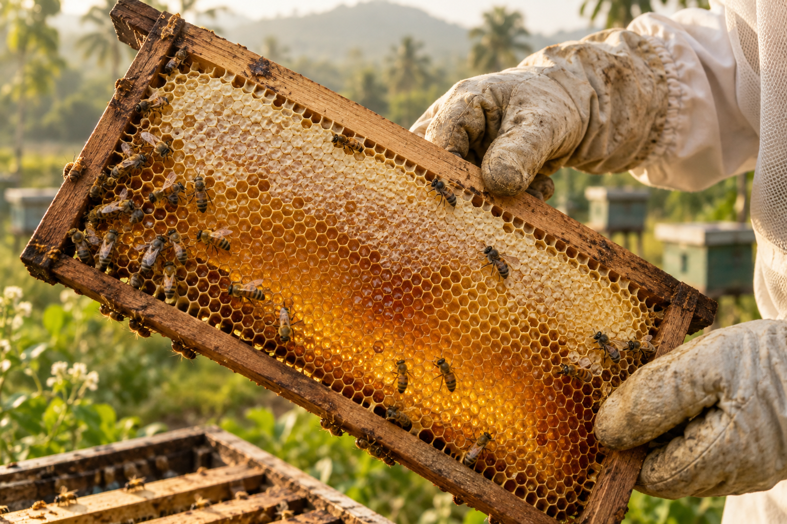
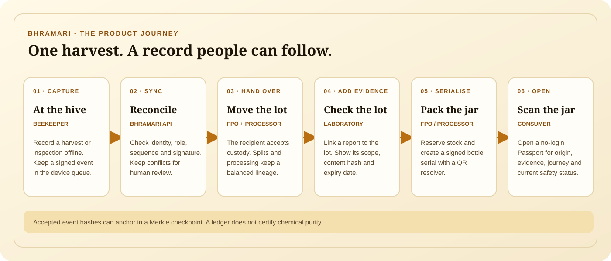
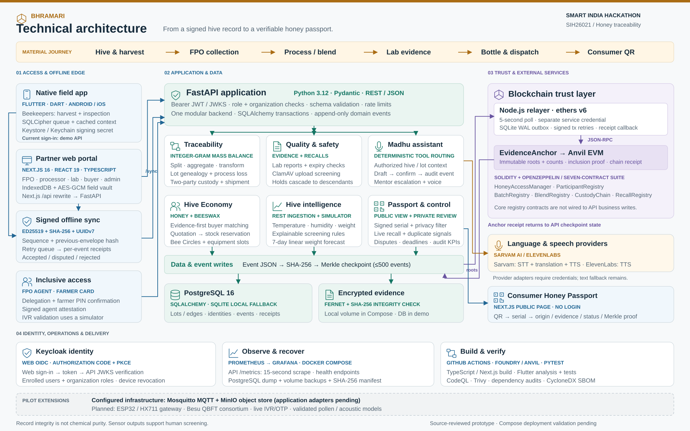

<div align="center">
  
  <h1>Bhramari</h1>
  <p><strong>Every jar remembers the hive it came from.</strong></p>
  <p>Honey traceability and inclusive hive management for Indian beekeeping clusters · SIH26021</p>
  <p>
    <a href="#quick-demo">Try the demo</a> ·
    <a href="#application-tour">Explore the app</a> ·
    <a href="#architecture">See the architecture</a>
  </p>
</div>

> Bhramari is a Smart India Hackathon prototype. Demo people, organisations, reports, sensor readings, and credentials are fictional. Record integrity does not prove honey purity.

## What Bhramari does

Bhramari connects field work to a bottle's public record. Beekeepers can save signed harvest and inspection records offline. FPOs, processors, and laboratories add custody, processing, and evidence. Consumers scan a bottle serial to see its origin, journey, evidence, and current safety status.

The same inventory model supports honey and beeswax. Buyer matching, mentor requests, shared equipment, Madhu, and a cluster control tower support the people around each hive.

### The hive-to-jar journey



## Quick demo

The sample-data demo runs the web app and API without Docker. Use PowerShell from the repository root. It needs Node.js 22 or later and Python 3.12 or later.

Install the dependencies:

```powershell
npm install
python -m venv .venv
.\.venv\Scripts\python.exe -m pip install -e .\services\api
```

Start the API in terminal 1. This stores the sample database and signing keys under your temporary directory.

```powershell
$demoData = Join-Path $env:TEMP "bhramari-readme-demo"
New-Item -ItemType Directory -Force -Path $demoData | Out-Null
$env:BHRAMARI_DEMO = "true"
$env:BHRAMARI_DATABASE_URL = "sqlite:///$($demoData.Replace('\','/'))/demo.sqlite"
$env:BHRAMARI_DATA_DIR = $demoData
$env:BHRAMARI_EVIDENCE_KEY = ""
$env:BHRAMARI_PASSPORT_PRIVATE_KEY = ""
.\.venv\Scripts\python.exe -m uvicorn bhramari.main:app --app-dir services/api --host 127.0.0.1 --port 8000
```

Start the web app in terminal 2:

```powershell
npm run dev
```

Open [http://localhost:3000](http://localhost:3000), then choose **Open demo workspace**. This new one-click entry signs in as a beekeeper. Choose **Choose another demo role** to use another account.

The demo API accepts `demo-honey-2026` for every role. Open the seeded bottle at [http://localhost:3000/passport/BHR-2026-0001](http://localhost:3000/passport/BHR-2026-0001). The sample Passport needs an online ledger receipt, so it may show **Needs online refresh** in this two-service mode.

Stop each server with `Ctrl+C`. The temporary database stays under `$env:TEMP\bhramari-readme-demo`.

## Full local stack

Docker Compose also starts PostgreSQL, Keycloak, Anvil, the ledger relayer, Mosquitto, object storage, ClamAV, Prometheus, and Grafana.

Copy `.env.example` to `.env` in PowerShell:

```powershell
Copy-Item .env.example .env
```

This command prints values for the seven required local secrets, including valid Fernet and Ed25519 keys. Paste each matching line into `.env`.

```powershell
python -c "import base64,secrets; print('\n'.join(f'{k}={v}' for k,v in [('POSTGRES_PASSWORD',secrets.token_urlsafe(32)),('KEYCLOAK_ADMIN_PASSWORD',secrets.token_urlsafe(32)),('MINIO_ROOT_PASSWORD',secrets.token_urlsafe(32)),('GRAFANA_ADMIN_PASSWORD',secrets.token_urlsafe(32)),('BHRAMARI_RELAYER_TOKEN',secrets.token_urlsafe(48)),('BHRAMARI_EVIDENCE_KEY',base64.urlsafe_b64encode(secrets.token_bytes(32)).decode()),('BHRAMARI_PASSPORT_PRIVATE_KEY',base64.b64encode(secrets.token_bytes(32)).decode())]))"
```

Start the stack after you add the generated values to `.env`:

```powershell
docker compose up --build -d
```

| Local service | Address |
| --- | --- |
| Web app | [http://localhost:3000](http://localhost:3000) |
| API documentation | [http://localhost:8000/docs](http://localhost:8000/docs) |
| Keycloak | [http://localhost:8080](http://localhost:8080) |
| Grafana | [http://localhost:3001](http://localhost:3001) |
| Prometheus | [http://localhost:9090](http://localhost:9090) |

Compose uses Keycloak sign-in. Its local fixture users are `beekeeper`, `fpo`, `processor`, `lab`, `buyer`, and `admin`. Each uses `bhramari-local` as its local-only password.

Compose bootstraps participant identities but does not seed the sample lots and bottle. Use the Quick demo for seeded records and the one-click sign-in. Do not use fixture credentials or the Anvil key outside an isolated prototype.

## Application tour

The workspace has twelve views. Role and organisation checks control private actions. The public Passport needs no login or wallet.

| View | What you can do |
| --- | --- |
| **Overview** | Review hive, inventory, lot, and exception summaries. Start the next field task. |
| **Hives & harvest** | Register hives, save inspections, and record honey or beeswax harvests. |
| **Offline vault** | Enable a device, keep signed events in its encrypted queue, and review sync receipts. |
| **Lots & packaging** | Trace lots, split or transform inventory, and create serialised bottle records. |
| **Custody & shipping** | Propose handovers, accept or dispute custody, and record shipment receipt. |
| **Evidence & recalls** | Attach expiring reports, check evidence hashes, or apply a hold or recall to a lot lineage. |
| **Buyer market** | Match available supply to requirements, then manage enquiries, quotations, and reservations. |
| **Bee Circles** | Ask moderated questions, request a mentor, and book shared equipment. |
| **Hive intelligence** | Review sensor readings, screening alerts, trends, and clearly labelled demo scenarios. |
| **Madhu** | Ask about authorised hives and lots. Review drafts and confirm an action before it is saved. |
| **Assisted access** | Record a Farmer Card request through an agent. Production voice and OTP are not connected. |
| **Control tower** | Review cluster KPIs, exceptions, and disputes. This view is for cluster administrators. |

### Follow a sample jar

1. Sign in as the beekeeper and open **Hives & harvest**.
2. Save a harvest locally, then review it in **Offline vault**.
3. Sign in as an FPO or processor to accept a handover and continue the lot journey.
4. Sign in as a laboratory user to attach evidence or place a hold.
5. Open the bottle's public Passport to check origin, evidence, and current safety status.
6. Sign in as the cluster administrator to review exceptions in **Control tower**.

The seeded jar uses serial `BHR-2026-0001`. Its laboratory report is demonstration data, not a partner result. The Passport keeps report evidence and ledger proof separate.

## Architecture



The web app uses Next.js. The field app uses Flutter. A modular FastAPI service handles identity, traceability, custody, evidence, Passport, community, market, and control workflows. A separate Node.js relayer anchors event hashes in Merkle checkpoints on the local Anvil chain.

Evidence files stay encrypted off-chain. The public Passport returns a privacy-filtered view. A chain receipt supports record integrity checks. A laboratory and authorised people decide what evidence means for quality or safety.

The repository includes Vercel descriptors for the web app and API. Those descriptors do not deploy the database, identity provider, relayer, or other local services.

## What is ready, simulated, and planned

| State | Scope |
| --- | --- |
| **Working prototype** | Identity checks, signed field records, lot genealogy, custody, packaging, evidence, recalls, ledger proofs, public Passports, Madhu tools, Hive Economy, Bee Circles, and control workflows. |
| **Simulated validation** | Assisted telephony and sensor intelligence use controlled inputs. Sensor alerts support human review and do not diagnose disease. |
| **Validation pending** | Full Compose startup on a Docker host and physical testing of the native app on a low-end Android device. |
| **Pilot or research** | Besu consortium governance, live telephony and OTP, validated pollen or acoustic models, credit products, and national rollout. |

The language menu currently lists 23 options. Set `SARVAM_API_KEY` for Sarvam transcription, translation, and speech. Set `ELEVENLABS_API_KEY` and `ELEVENLABS_VOICE_ID` for the alternate speech route. Text fallback remains available.

## Trust and privacy

- Accepted events are append-only and linked to their source records.
- The relayer anchors event hashes and checkpoint metadata. It does not put reports or personal data on-chain.
- Quantity rules help identify digital over-allocation. They cannot prove how a colony was fed.
- A blockchain receipt proves record integrity. It does not prove chemical purity, food safety, or certification.
- A QR label can be copied. Serial checks and current hold or recall status support review.
- Demo identities, passwords, reports, and sensor inputs are local fixtures. Replace them before any pilot.

## Development checks

Run checks from the repository root after installing the relevant dependencies:

```powershell
.\.venv\Scripts\python.exe -m pytest -q services/api
npm test --prefix contracts
npm test --prefix services/ledger
npm run typecheck --workspace apps/web
npm run build --workspace apps/web
Push-Location apps/field
flutter analyze
flutter test
Pop-Location
```

See the [implementation and acceptance ledger](docs/implementation-status.md) for recorded results and pending validation.

GitHub Actions workflows define API, web, contract, ledger, and Flutter checks, plus dependency audits, CodeQL, Trivy, and SBOM generation. See [`.github/workflows`](.github/workflows).

## Project guides

- [Canonical scope and roadmap](docs/canonical-plan.md)
- [Architecture notes](docs/architecture/source-notes.md)
- [Operations and recovery runbook](docs/operations.md)
- [KVIC cluster deployment pack](docs/kvic-cluster-deployment.md)
- [Six-minute product demonstration](docs/demo-script.md)
- [Product video production brief](docs/bhramari-heygen-product-video.md)
