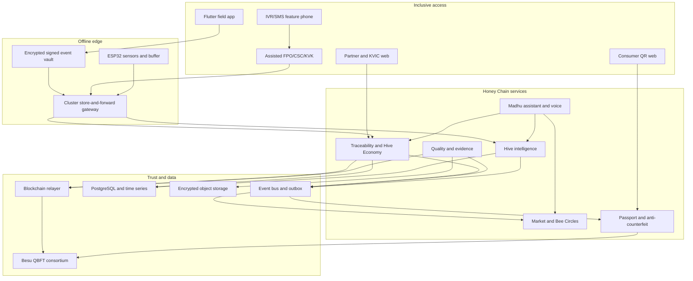

# Honey Chain — Canonical Implementation Plan

## 1. Executive decision

Honey Chain is an **offline-resilient, voice-enabled B2B2C Hive Economy and Trust Network** for Indian beekeeping clusters.

It is not a cryptocurrency, a generic marketplace, an IoT dashboard, or a QR landing page. It joins five capabilities into one working system:

1. accountable hive-to-jar lot traceability;
2. offline and assisted participation for rural beekeepers;
3. tamper-evident multi-party evidence using a permissioned ledger;
4. Madhu, a multilingual role-aware operating assistant;
5. verified market linkage for honey and selected hive products.

**Core promise:** Capture locally. Verify collaboratively. Anchor permanently. Explain simply.

**Winning statement:** Honey Chain gives every beekeeper a voice, every hive output a market identity, every custody event accountable proof, and every consumer an understandable reason to trust.

## 2. Truth boundaries

- Trace accountable lots, containers, transformations and bottle serials, not molecular “individual drops.”
- Blockchain proves that accepted records were not silently altered; it does not chemically prove honey purity.
- Mass balance detects impossible or duplicate digital quantities; it cannot prove a colony was not fed sugar syrup.
- Pollen microscopy, moisture readings and acoustics are screening evidence, not conclusive diagnosis/authentication.
- A bottle QR can be copied; serialisation, tamper-evident labels and clone analytics reduce that risk.
- Offline evidence can be signed and sealed locally; an independent local chain does not merge into a global chain.
- AI offers risk screening and approved guidance; authorised humans/labs make safety, treatment, certification, recall and credit decisions.
- “Pan-India prototype” means configurable regions, languages and simulated clusters. Real rollout remains cluster by cluster.

## 3. Problems and responses

| Problem | Product response | Verifiable outcome |
|---|---|---|
| Counterfeit/untraceable honey | serialised jar, batch genealogy, lab evidence, custody and mass balance | every verified jar resolves to source lot(s) and current safety state |
| Low consumer trust | no-login Honey Passport with simple/audio explanation | consumer understands origin, evidence, journey and freshness |
| Weak market linkage | verified supply pools, structured buyer requirements and assisted B2B enquiry | buyer can shortlist evidence-complete available lots |
| Rural exclusion | encrypted offline app, sync receipts, IVR/SMS simulation and assisted agents | harvest captured offline or through accountable agent |
| Hive losses | low-cost telemetry, rules/anomaly screening and Madhu guidance | actionable alert with uncertainty and escalation |
| Lost by-product value | common Hive Product Lot model; beeswax MVP | cappings become traceable beeswax lot and buyer enquiry |

## 4. Frozen scope

### Mandatory foundation

1. Identity, organisations, roles, consent and device-key lifecycle.
2. Hive registry and offline field records.
3. Lot, quantity, split, aggregation, transformation, custody, shipment and packaging lineage.
4. Laboratory/evidence records and recall/hold status.
5. Blockchain proof anchoring and indexed verification.
6. Unique bottle QR and public Honey Passport.

### Four signature MVPs

1. **Offline-First Trust:** airplane-mode harvest signed locally, safely synchronised and anchored later.
2. **Madhu:** one assistant completing role-specific voice/text journeys using authorised context.
3. **No Farmer Left Behind:** low-end smartphone mode plus demonstrable IVR/assisted feature-phone workflow.
4. **Hive Economy:** honey and beeswax share traceability, inventory and buyer discovery.

### Supporting MVP

- one physical or simulated temperature/humidity/weight hive feed;
- explainable threshold/anomaly alert;
- Bee Circle mentor request and shared-equipment booking;
- one buyer requirement matched against verified supply;
- one recall or duplicate-QR risk demonstration;
- Hindi, Marathi and English provider fallback;
- KVIC/FPO exception dashboard.

### Roadmap only

- pollen classifier after controlled data and laboratory validation;
- acoustic colony model after labelled field collection;
- Bhuvan/Copernicus bloom/pesticide intelligence after data/API validation;
- live national IVR/USSD/operator integration;
- pollination impact/finance certificates and credit underwriting;
- propolis, pollen, royal jelly, bee venom and live-colony commerce;
- 3D consumer visualisation;
- national production blockchain consortium.

## 5. One-page architecture



## 6. Competition deployables

The target has clean bounded contexts; the 14-day prototype uses six deployable units instead of fourteen fragile containers.

| Deployable | Contains |
|---|---|
| `edge-access` | gateway, identity adapter, field sync, assisted-access/IVR adapter |
| `traceability-core` | hive registry, lots, quantity, transformations, custody, logistics, quality metadata |
| `trust-ledger` | relayer, Merkle checkpoints, contracts, indexer, proof verifier |
| `hive-intelligence` | MQTT, time series, rules/anomaly inference |
| `madhu` | role/intent/policy, RAG, tools, STT/TTS, notifications |
| `engagement-commerce` | passport, Bee Circles, buyer matching, control-tower projections |

- FastAPI for Python services; Node.js/Ethers v6 for the relayer.
- PostgreSQL schemas separated by bounded context; no direct cross-service table access.
- Redpanda/Kafka-compatible events plus transactional outbox.
- Docker Compose for prototype; Kubernetes is a target, not an SIH dependency.
- Versioned OpenAPI and domain-event schemas freeze before parallel work.

## 7. Experience surfaces

### Field application

Flutter native Android/iOS; Android tested first on a low-end device. Next.js remains the web stack. Core screens: language/consent, online/offline state, hive list, inspection, voice harvest, lot QR, pending/conflict queue, Madhu, Bee Circles, buyer demand and honey/beeswax inventory.

Use flat high-contrast surfaces, strong borders, large targets and icons plus words/audio. Do not use low-contrast glassmorphism/neumorphism or claim “zero text.”

### Partner portal

FPO/lab/processor/distributor/retailer workspaces: scan/receive custody, aggregate/split/transform, evidence upload, stock reservation, serial generation, hold/recall, reconciliation and exception queue.

### Consumer Passport

No login/wallet. Show `Verified record`, `Needs online refresh`, `Suspected duplicate`, `On hold/recall`, or `Unknown`; origin, evidence freshness, accessible lineage timeline, consented producer story, audio, report-concern and technical proof.

### Control tower

Incomplete lineage, unanchored events, quantity conflicts, duplicate serials, expiring evidence, recall descendants, hive alerts, demand gaps, Bee Circle operations and audit KPIs.

## 8. Feature-phone inclusion

A keypad phone cannot scan QR, hold a device key or run an offline app. It participates through accountable assisted access:

```text
Call/SMS/missed call -> telephony/IVR adapter -> pending request
-> authorised FPO/CSC/KVK agent -> Farmer Card scan
-> assisted form + farmer PIN/OTP/voice confirmation
-> signed agent attestation -> normal validation pipeline
```

Prototype one complete IVR-to-agent journey. Store `captureMode=ASSISTED`, agent identity and consent method. Never claim production telco/CSC/KVK integration without agreement.

## 9. Offline-first mechanism

The phone is a cryptographic evidence-capture client, not a blockchain node.

```text
schemaVersion, eventId(UUIDv7), actorId, organisationId,
eventType, subjectId, occurredAt, deviceSequence,
previousEventHash, payloadHash, attachmentHashes,
keyId, captureMode, signature
```

Use canonical JSON/CBOR, EIP-712-compatible typed signing where required, Android Keystore/iOS Keychain and SQLCipher.

```text
Receive -> schema/hash/signature/key validation -> replay/sequence check
-> role/domain invariants -> accepted/rejected/disputed
-> transactional save -> Merkle checkpoint -> relayer
-> blockchain receipt and inclusion proof
```

Quantity, custody, certification and recall conflicts never use last-write-wins. Preserve both claims and route to review. Retry is idempotent by event ID.

## 10. Traceability and QR

Use GS1 EPCIS-style `what, when, where, why, how` events and a provenance DAG.

| Operation | Rule |
|---|---|
| Harvest | creates source lot from registered hive/actor evidence |
| Aggregate | groups lots/containers without losing parents |
| Split | children cannot exceed available parent quantity |
| Transform/blend | inputs consumed; output and process loss/tolerance recorded |
| Handover | proposed -> accepted/disputed -> settled |
| Ship/receive | location and custody reconcile |
| Pack/serialise | bottle maps to pack batch and ancestors |
| Correct | append correction; never rewrite history |
| Hold/recall | descendants inherit restriction |

Quantities use integer base units and explicit units.

QR levels: permanent hive tag, harvest/container lot, drum/logistics unit, shipment/pallet, internal pack batch and unique tamper-evident bottle serial. Bottle QR carries a resolver URL, serial, issuer key ID and signed compact certificate—not full history.

Protection: activation, destructible label, signature, repeated/impossible scan anomaly and live recall status. Suspicion triggers review, not automatic accusation.

## 11. Blockchain

Stack: Solidity, OpenZeppelin v5, Foundry/Forge, Anvil for reliable SIH demo, optional four-node Besu sandbox after the Anvil path passes, Besu QBFT pilot target and Ethers v6 relayer.

Contracts: `HoneyAccessManager`, `ParticipantRegistry`, `BatchRegistry`, `CustodyChain`, `BlendRegistry`, `EvidenceAnchor`, `RecallRegistry`; optional non-transferable `BeekeeperCredential` only after core completion.

No PII, raw telemetry, images or PDFs on-chain. Store encrypted evidence off-chain and anchor hashes/Merkle roots. Beekeepers do not mine or pay gas. Institutional validator governance is a pilot decision. Infrastructure still costs money even if end-user gas is removed.

## 12. Madhu

Madhu is a role-aware operating assistant, not a generic chatbot.

```text
Voice/text -> language/STT -> identity/role -> intent/risk
-> authorised user/hive/batch context -> approved knowledge + tools
-> answer/draft -> confirmation if action -> local-language TTS
```

Knowledge: reviewed KVIC/ICAR/KVK/FSSAI material, procedures, equipment guides and moderated FAQs, all versioned with source/freshness.

Tools: `get_hive_status`, `draft_inspection`, `draft_harvest`, `get_batch_lineage`, `check_quantity`, `get_lab_status`, `track_shipment`, `check_recall`, `find_buyer_demand`, `request_mentor`, `book_equipment`, `explain_passport`.

| Risk | Behaviour |
|---|---|
| Read-only | answer with source/timestamp |
| Draft | prepare and read back |
| Operational | explicit confirmation |
| Custody | both parties confirm |
| Treatment/safety | approved guidance plus escalation |
| Certification/recall/finance | authorised human only |
| Blockchain | policy service and relayer only |

Offline Madhu provides cached audio/FAQs, guided forms, inspections, task playback and queued support; it does not pretend a cloud LLM is local. Feature phones use IVR and human escalation. Use provider adapters with typed/cached fallback. Never evade provider quotas by rotating consumer accounts.

MVP journeys: offline voice harvest; hive concern with uncertainty/mentor escalation; processor quantity check; consumer provenance explanation.

## 13. Hive intelligence

Prototype: ESP32, temperature/humidity, load cell/HX711, MQTT, local buffer and deterministic simulator fallback. Microphone may be research instrumentation.

MVP analytics: thresholds/rate-of-change, missing/stuck/impossible sensors and a simple anomaly model only if credible data exists. Store model/version, input window, confidence and explanation. No automated treatment.

Acoustic FFT and pollen images may be labelled **research instrumentation**, never validated diagnosis or purity percentage. Long-term defensibility comes from a consented labelled feedback loop joining telemetry, inspections, lab evidence and outcomes.

## 14. Hive Economy

Use generic `HiveProductLot`: product type, source, method, quantity/unit, evidence, storage, custody and buyer specification.

MVP:

```text
Extraction -> wax/cappings -> Beeswax Lot QR
-> cleaning transformation -> evidence/specification
-> buyer match -> enquiry -> custody/status
```

Pollen, propolis, royal jelly, venom, colonies and pollination services require separate handling/regulatory schemas and remain roadmap items.

## 15. Market linkage

Decision: **B2B2C**. Primary economic engine is verified cluster supply to processors, packers, retail, hospitality, institutions, gifting, exporters and beeswax users. Consumer engine is Passport, producer story, feedback and partner fulfilment. Honey Chain does not initially own national last mile.

Buyer requirement:

```text
product, floral/origin preference, quantity/MOQ,
quality/lab/certification requirements, packaging,
delivery place/date, target range, payment terms
```

Filter compliance first; then explain matches using verified availability, specification, logistics and fulfilment. Apply exposure floors for new/small circles. MVP ends at shortlist, sample/enquiry, quotation and purchase-order status; payment/escrow/credit remain integrations.

KisanKonnect lesson: adopt organised producer relationships, quality standardisation, consumer trust and omnichannel feedback. Do not copy cold-chain/dark-store intensity, broad grocery or immediate last-mile ownership. Make necessary intermediaries accountable rather than claiming they disappear.

## 16. Bee Circles

Moderated production/support groups, not addictive popularity feeds:

- voice/photo questions and verified mentors;
- local hive/pesticide/collection alerts;
- shared equipment and transport;
- by-product aggregation;
- supply forecast/order allocation;
- training/evidence tasks;
- complaints, dispute and appeal;
- offline/IVR/SMS digest.

Assurance uses traceability completeness, valid evidence, training/inspection, alert response, delivery reconciliation, mentorship and resolved complaints. Exclude likes, wealth, device/connectivity and protected attributes. Make the profile explainable, time-bounded and appealable.

## 17. Security and privacy

- OIDC/OAuth2; organisation RBAC plus attributes.
- Keystore/Keychain, key rotation, revocation and recovery.
- multisig/timelocked contract governance for production.
- encryption, signed URLs and malware scanning.
- separate public Passport projection from private operations.
- consent purpose, expiry, withdrawal and audit trail.
- no exact protected hive coordinates in public/on-chain views.
- rate limits, schema validation, SAST/DAST, SBOM, secret/container scanning.
- Foundry fuzz/invariants and Slither; independent production audit.
- backup/restore drill, monitoring and incident response.
- Madhu prompt/tool injection protection, allowlisted tools and confirmations.

## 18. Stack

| Concern | Choice |
|---|---|
| Field | Flutter native, SQLCipher |
| Web | Next.js/React |
| APIs | FastAPI/Pydantic/OpenAPI |
| Identity | Keycloak |
| Data | PostgreSQL, TimescaleDB, Redis |
| Events | Redpanda/Kafka + outbox |
| IoT | MQTT, EMQX/Mosquitto |
| Files | encrypted MinIO/S3-compatible storage |
| Chain | Solidity, OpenZeppelin, Foundry, Anvil; Besu QBFT target |
| Observability | OpenTelemetry, Prometheus, Grafana, Loki/Tempo |
| Deployment | Docker Compose prototype; Kubernetes later |

MCP is optional for future authorised institutional AI clients. It is not required for mobile, QR, blockchain, Madhu, or offline sync.

## 19. Fourteen-day build

### Days 1–2 — contracts

Freeze IDs, roles, events, journeys and acceptance tests; establish monorepo/CI/Compose/seed/design system; provide API mocks.

### Days 3–5 — vertical proof

Participant/hive/harvest; offline signing; lot graph; Solidity/Foundry/Anvil; sync/anchor receipt; bottle resolver.

**Gate:** airplane-mode harvest becomes an anchored bottle ancestor.

### Days 6–8 — chain completion

Custody, aggregate, split, transform, pack, recall, lab hash, Passport, beeswax and buyer matching.

**Gate:** quantity and recall invariants pass.

### Days 9–10 — Madhu/inclusion

Role-intent-policy, approved RAG, four journeys, provider fallback and IVR-to-assisted-agent simulation.

**Gate:** Madhu cannot bypass permissions/confirmation/safety.

### Days 11–12 — intelligence/community/control

Sensor/simulator, alert, mentor/equipment, control dashboard and duplicate/recall incident.

### Days 13–14 — hardening

Offline replay/conflict, low-end device, security/privacy, benchmarks, six-minute demo, backup recording and release freeze.

## 20. Team of six

| Owner | Scope |
|---|---|
| Lead/integration | schemas, release, demo and pitch |
| Blockchain | contracts, Foundry, chain, relayer/indexer |
| Backend | traceability, sync, quality, market/events |
| Mobile | Flutter vault, field and assisted UX |
| Web/design | Passport, portals, control/accessibility |
| AI/IoT/Madhu | sensors, inference, RAG, voice/tool policy |

## 21. Six-minute demo

1. Inclusion/problem — smartphone plus Farmer Card/feature-phone request (40 sec).
2. Offline proof — Madhu creates 18 kg harvest in airplane mode (90 sec).
3. Trust — reconnect, validate/anchor, FPO custody, lab hash, split/pack (80 sec).
4. Market/Hive Economy — beeswax and buyer match (50 sec).
5. Consumer — scan/listen/verify Passport (60 sec).
6. Control/scale — duplicate/recall, mentor/equipment and roadmap (60 sec).

Keep source code, model training and chain internals for Q&A.

## 22. Acceptance gates

- Every verified bottle resolves to source lot(s).
- No input quantity is consumed twice; recall reaches descendants.
- Custody requires roles/approvals; evidence mutation fails hash check.
- Offline record survives airplane mode/restart; retry is idempotent; conflicts remain reviewable.
- Assisted record captures agent and consent; IVR completes one useful request.
- Madhu respects authorisation, source/freshness, confirmation and escalation.
- Consumer needs no login/wallet; no protected data leaks publicly/on-chain.
- Demo survives provider/sensor failure with cached/deterministic fallback.

## 23. Performance targets

Targets become claims only after measurement.

| Journey | Target |
|---|---|
| Local save | under 500 ms after attachment hash |
| Low-end Android usable launch | under 3 seconds |
| Demo trace query | under 1 second |
| Consumer first useful view | under 2 seconds on normal 4G/cache |
| Madhu first streamed audio | under 2.5 seconds when supported |
| Sync | asynchronous, visible, retry-safe; never waits on blockchain to save locally |

## 24. Claim labels

- **Working prototype:** end-to-end and acceptance-tested.
- **Simulated validation:** real rules with controlled data.
- **Pilot roadmap:** designed, not implemented.

No screen/stub is called working. No unmeasured purity, disease accuracy, income, price, yield or fraud-reduction percentage is claimed.

## 25. Rollout

- **Co-design, 4–6 weeks:** observe cluster operations; validate IDs, containers, language, consent and KPIs.
- **Controlled pilot, 8–12 weeks:** one FPO/lab/processor, 20–50 beekeepers, limited instrumented hives and packaged batch.
- **Multi-party validation, 3–6 months:** Besu consortium, telephony/lab integrations, regional data, audit/runbooks.
- **Scale:** multi-region operations, validator governance, devices, buyer APIs and evaluated languages/models.

## 26. Critique and resolution log

| Weakness/claim | Resolution |
|---|---|
| Plan had grown repetitive and over-scoped | rewritten as one canonical priority document |
| Fourteen services in 14 days | six deployables with bounded-context separation |
| Phone described as blockchain node | corrected to signed evidence client |
| Blockchain claimed to enforce biology | limited to digital invariants and provenance integrity |
| Pollen allegedly proves purity/syrup absence | moved to lab-validated research screening |
| Fixed frequencies allegedly diagnose queen/swarm/Varroa | moved to multimodal research; no clinical certainty |
| Satellite sync/pesticide maps lacked validated operations/data | roadmap/remove until proven |
| Feature phone appeared to connect directly | explicit telephony and assisted-attestation flow |
| DID/IPFS/3D added complexity without MVP value | optional/replaced/progressive enhancement |
| Automated credit/ESG claims were high-risk | roadmap with governance and partners |
| Market linkage was a catalogue | structured requirements, match, enquiry and PO state |
| Community could become popularity scoring | evidence-based, explainable, appealable assurance |
| External APIs could break demo | cached voice, typed fallback, simulator and fixtures |
| Ambition could become false claims | working/simulated/roadmap labels and measurement rule |

## 27. Protected proof

```text
Verified participant/hive -> Madhu-guided offline harvest
-> signed replay-safe sync -> lot genealogy/evidence
-> blockchain checkpoint -> FPO custody/pack serial
-> B2B match and beeswax lot -> consumer QR/audio Passport
-> recall/duplicate exception in control tower
```

If schedule slips, cut 3D, pollen, acoustic model, multi-node Besu and advanced marketplace UI first. Never cut traceability correctness, offline replay safety, role permissions, QR resolution or the working narrative.

## 28. Sources

1. GS1, [EPCIS Standard 2.0](https://ref.gs1.org/standards/epcis/2.0.0/), June 2022.
2. Foundry, [Ethereum development toolkit](https://www.getfoundry.sh/).
3. OpenZeppelin, [Contracts access control](https://docs.openzeppelin.com/contracts/5.x/access-control).
4. Hyperledger Besu, [QBFT documentation](https://besu.hyperledger.org/private-networks/how-to/configure/consensus/qbft).
5. Ethereum, [EIP-712](https://eips.ethereum.org/EIPS/eip-712).
6. Intertek, [HoneyTrace](https://www.intertek.com/food/honey-solutions/honeytrace/).
7. KisanKonnect, [FarmFresh application](https://apps.apple.com/in/app/kisankonnect-farmfresh-produce/id1522745145).
8. Government of India, [Common Service Centres](https://www.india.gov.in/category/science-it-communication/subcategory/information-technology/details/website-of-common-services-centers-csc-jaankari-suvidha).
9. ICAR, [Krishi Vigyan Kendras](https://www.icar.gov.in/en/krishi-vigyan-kendras-kvks).
